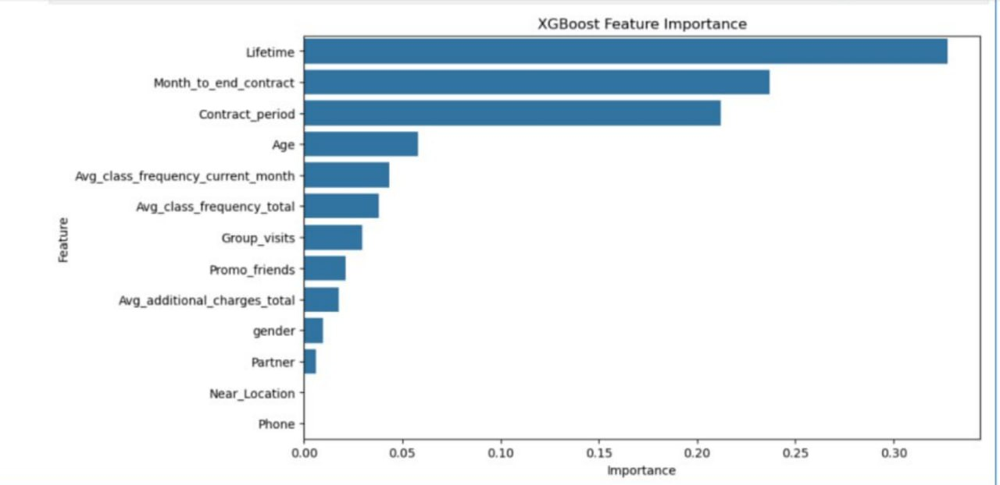

# Gym Members Churn Prediction Using Machine Learning
https://github.com/Kafeeya/gym-customer-churn-prediction

# 1. Problem Statement and Motivation

## Problem Statement

Customer churn is a major challenge for fitness centres because losing members directly reduces revenue and increases the cost of acquiring new customers. It is difficult for gym management to identify which customers are likely to leave before they cancel their memberships.

This project aims to build a machine learning classification model that predicts whether a gym member will churn based on customer demographics, membership information, attendance history, and spending behaviour.

## Motivation

Predicting customer churn allows gyms to identify high-risk customers early and take preventive actions such as offering discounts, personalised training programmes, or promotional campaigns. Accurate churn prediction helps improve customer retention, increase profitability, and support better business decision-making.

# 2. Dataset and Preprocessing

## Dataset

- **Dataset Name:** gym_churn_us.csv
- **Problem Type:** Binary Classification
- **Target Variable:** Churn
- **Features:** 13 input features and 1 target column

Some important features include:

- Gender
- Near_Location
- Partner
- Promo_friends
- Phone
- Contract_period
- Group_visits
- Age
- Avg_additional_charges_total
- Month_to_end_contract
- Lifetime
- Avg_class_frequency_total
- Avg_class_frequency_current_month

The target variable is:

- **0 = Customer Stayed**
- **1 = Customer Left (Churn)**


### Missing Values

No missing values requiring treatment were found.

### Duplicate Removal

Duplicate records were removed using

### Outlier Handling

Outliers were handled using the Interquartile Range (IQR) capping method.

Each numerical feature (excluding the target variable) was clipped within acceptable lower and upper bounds.

# Feature Importance Analysis

After selecting XGBoost as the best-performing model, feature importance analysis was performed to determine which variables had the greatest influence on customer churn prediction.

The analysis showed that not all features contributed equally to the prediction. Some variables had a much stronger impact than others.



## Top Important Features

| Rank | Feature | Importance |
|------|----------|------------|
| 1 | Lifetime | Highest |
| 2 | Month_to_end_contract | Very High |
| 3 | Contract_period | High |
| 4 | Age | Moderate |
| 5 | Avg_class_frequency_current_month | Moderate |
| 6 | Avg_class_frequency_total | Moderate |
| 7 | Group_visits | Low |
| 8 | Promo_friends | Low |
| 9 | Avg_additional_charges_total | Low |
| 10 | Gender | Very Low |
| 11 | Partner | Very Low |
| 12 | Near_Location | Almost Zero |
| 13 | Phone | Almost Zero |

The feature importance analysis revealed that **Lifetime** was the most influential feature in predicting customer churn. This indicates that the length of time a customer has been a gym member plays the biggest role in determining whether they are likely to leave.

The second most important feature was **Month_to_end_contract**, suggesting that customers with fewer remaining months on their contracts are more likely to churn.

The **Contract_period** feature also contributed significantly, indicating that the length of a customer's membership contract affects retention.

Customer **Age** and gym attendance variables, such as **Avg_class_frequency_current_month** and **Avg_class_frequency_total**, had a moderate influence on churn prediction. Members who attend the gym more consistently are generally less likely to cancel their memberships.

Features such as **Group_visits**, **Promo_friends**, and **Avg_additional_charges_total** had a relatively small impact on the prediction.

Finally, **Gender**, **Partner**, **Near_Location**, and **Phone** contributed very little to the model. These variables had minimal influence on customer churn and may not be critical predictors in this dataset.


### Encoding

Categorical variables were converted into numerical values using LabelEncoder.

### Feature Scaling

StandardScaler was applied before training Logistic Regression because it performs better on scaled data.


# 3. Algorithms

Four machine learning algorithms were trained and compared.

## Logistic Regression

Logistic Regression is a linear classification algorithm that predicts the probability of a customer churning. It was selected because it is simple, fast, and provides a strong baseline for binary classification problems.

## Decision Tree

Decision Tree classifies customers by learning a sequence of decision rules from the training data. It was chosen because it can capture nonlinear relationships and is easy to interpret.

## Random Forest

Random Forest is an ensemble learning algorithm that combines multiple decision trees to improve prediction accuracy and reduce overfitting. It was selected because it generally performs well on structured datasets.

## XGBoost

XGBoost is a gradient boosting algorithm that builds trees sequentially while correcting previous errors. It was selected because it is one of the most accurate algorithms for structured tabular datasets and usually achieves excellent predictive performance.


# 4. Results and Discussion

Each model was evaluated using the following metrics:

- Accuracy
- Precision
- Recall
- F1 Score
- ROC-AUC Score

## Model Comparison

The performance of the four machine learning models was compared using **Accuracy**. The comparison results are shown below.

| Model | Accuracy |
|--------|----------|
| XGBoost | **94.13%** |
| Logistic Regression | **92.50%** |
| Random Forest | **92.00%** |
| Decision Tree | **89.63%** |

## Discussion

The four machine learning models were evaluated and compared based on their prediction accuracy.

Among all the models, **XGBoost** achieved the highest accuracy of **94.13%**, making it the best-performing model for predicting gym member churn. Logistic Regression ranked second with an accuracy of **92.50%**, followed closely by Random Forest at **92.00%**. Decision Tree achieved the lowest accuracy of **89.63%**.

Although Logistic Regression and Random Forest performed well, XGBoost produced the most accurate predictions and demonstrated better overall performance. Therefore, **XGBoost** was selected as the final model for deployment.

## Sanity Check

To verify whether the model generalizes well, the training and testing accuracies were compared.

| Metric | Value |
|--------|-------|
| Training Accuracy | **100.00%** |
| Testing Accuracy | **94.13%** |
| Difference | **5.87%** |
| Result | **Slight Overfitting** |

The difference between the training and testing accuracies was **5.87%**, indicating **slight overfitting**. However, the testing accuracy remained high, suggesting that the model generalizes well to unseen data and is suitable for predicting customer churn.

The final sanity check showed that the selected model generalised well to unseen data.

## Best Model

Among the four algorithms, **XGBoost** achieved the highest prediction accuracy and the strongest overall performance.

Reasons include:

- Better handling of nonlinear relationships
- High predictive accuracy
- Strong generalisation
- Robust performance on structured datasets


# 5. Deployment Notes

The trained XGBoost model was saved using Joblib.

```python
joblib.dump(xgb_model, "gym_churn_best_model.pkl")
```

The saved model can be loaded by a Flask API or Streamlit application for real-time predictions.

## Example API Request

```json
{
  "Age": 35,
  "Contract_period": 12,
  "Lifetime": 8,
  "Avg_class_frequency_total": 2.8,
  "Avg_class_frequency_current_month": 2.4
}
```

## Example API Response

```json
{
  "prediction": "No Churn",
  "probability": 0.91
}
```

If connected to a frontend, users can enter customer information through a web form and instantly receive a churn prediction.

---

# 6. Lessons Learned

During this project, several valuable lessons were learned.

## Challenges

- Understanding the dataset before modelling.
- Handling outliers without losing useful information.
- Creating meaningful engineered features.
- Comparing multiple machine learning models fairly.
- Evaluating model performance using different metrics.

## Improvements

Future improvements could include:

- Hyperparameter tuning using GridSearchCV.
- Cross-validation for more reliable evaluation.
- SHAP values for model explainability.
- Deploying the model as a cloud-hosted API.
- Building a complete customer retention dashboard.

## Key Takeaways

This project demonstrated the complete machine learning workflow from data preprocessing to deployment.

Comparing multiple algorithms helped identify the most suitable model, while feature engineering significantly improved the predictive capability of the system.

The final XGBoost model can support gym businesses by identifying customers who are at risk of leaving and enabling proactive retention strategies.